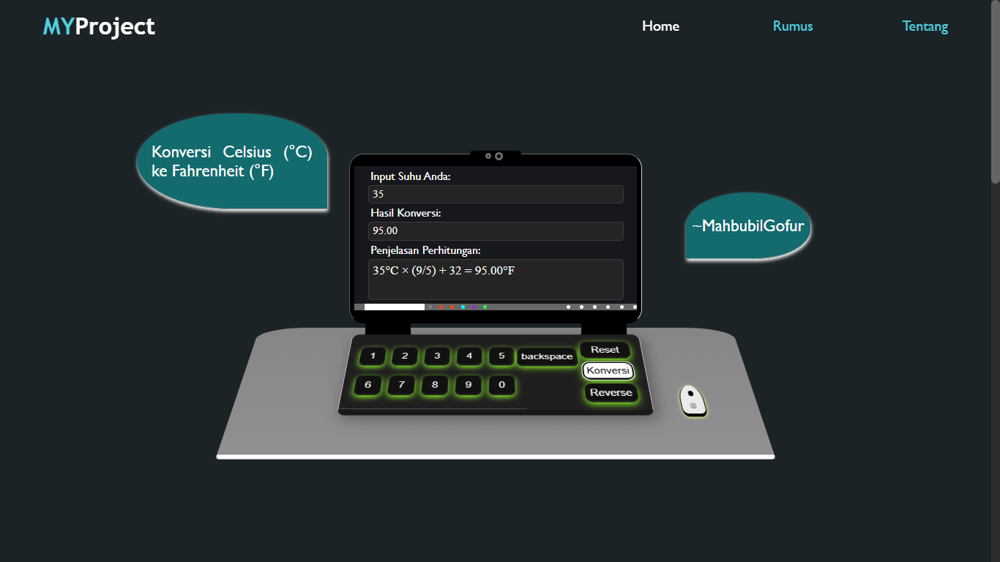

# MYProject - Kalkulator Suhu

Website sederhana untuk mengonversi suhu antara Celsius (°C) dan Fahrenheit (°F). Dibuat dengan HTML, CSS, dan JavaScript.

## 📸 Screenshot

## 🚀 Fitur

- Input suhu
- Konversi suhu otomatis
- Tombol reset & reverse
- Penjelasan rumus konversi
- Responsif di semua ukuran layar

## 🛠️ Teknologi

- HTML
- CSS (Responsif + Animasi)
- JavaScript

## 📦 Cara Menggunakan

1. Masukkan suhu pada kolom input
2. Klik tombol **Konversi**
3. Lihat hasil dan penjelasan rumus di bawahnya
4. Gunakan tombol **Reset** atau **Reverse** sesuai kebutuhan

## Link GitHub Pages

Untuk melihat hasil project secara langsung, klik [di sini](https://revou-fundamental-course.github.io/21-apr-25-mahbubilgofur/).
